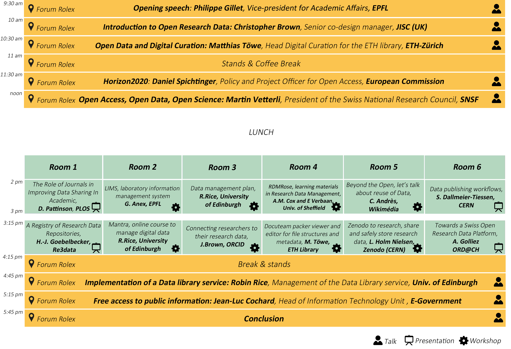

% Open Research Data
% notes : iGor

---
Title: Open Research Data
Author: iGor
Date: 2014-10-28
Tags: données de la recherche, opendata, ID
---

I.Kratz : petit mot d'accueil. Importance de l'OAI, et de l'engagement de l'EPFL dans le domaine. La majeur partie de l'information utile pour la recherche est dans les données, pas dans les articles (75/25%).

# Ouverture

Le mot de P. Gillet. Présentation de l'EPFL. Capte presque le 1/3 des financements de la recherche. Liste des grands projets, dont le Human Brain et le Time Venice Machine. Mention de Kroes et la commission EU. Souligne l'importance de l'ouverture pour la science, blabla. Bien entendu, des sci-data. Le "décodage" du génome a déjà exigé que les chercheurs partagent leurs données pour réussir. Autre exemple, la production de données par le CERN, la qtité de donnée, souvent unique, nécessité d'en permettre la réutilisation. Idem avec Hubble, récolte trop de données pour n'être traitées que par les chercheurs ayant direct accès. Etc. On n'utilise actuellement que le 10% des données qui ont été produites ou récoltés dans l'histoire de la découverte spatiale. Serait intéressant de savoir quelle part est réellement utilisable...

Financement public, accès public.

Exigences pour les institutions de préserver et diffuser les données. Les bailleurs de fonds l'imposent de plus en plus dans leur _policies_ (règlementations).

Challenge : technique, légal, éthique, etc. Mentionne l'importance des bibliothèques, du SI, à des degrés divers.

Présente la suite du programme, cf figure 1.

Importance de la curation pour permettre la réutilisation, donc des formats ouverts et des metadata.

# Introduction au _Research Open Data_
par Ch. Brown

"_a JISC perspective_"

Mission de faire du UK le pays le plus avancé en univers numérique, du point de vue de la recherche. JISC apport uen aide à l'infrastructure qui soutend le réseau des chercheurs en UK. Donne des conseils et fait de la recherche.

Déf de l'ORD. Bcp de données qui font les RD ne sont pas numériques. Doivent être ouverte. Mais des obstacles : mauvaise interprétation, erreurs, non intéressantes, les permissions pour le partage, qui possède les données, la peur face aux questions du public...

Le 4e paradigm : l'exploration des données de la recherche.

Pour faire de la recherche il faut un réseau permettant la réutilisation et le travail collaboratif. Jisc : knowledge exchange response. Définir les motivations.

  * quitter l'idées que les données sont privatives
  * communication
  * des standards communs
  * une ouverture des données "intelligente"
  *
  * les outils de la préservation/conservation

Le tout est bien entendu basé sur des règlements, directives, avec la mise en évidence de l'intérêt public, qui finance. Détermine ce qui rend possible (métadonnées, outils de recherche, paternité), et l'importance de la préservation, avec toutes ces difficultés.

La diversité des données engagées est édonnantes : réseaux sociaux, données personnelles.

Il faut pouvoir rendre service aux chercheurs de ce point de vue, afin de les motiver à participer et à le faire correctement.

Principes des OD. Ce qui permet de les définir ainsi. Le coût pour rendre les données open doit faire partie des budgets, mais est-ce le cas ? Mention des limites de l'ouverture : business, données personnelles...

Exemples de ce qu'ils font, avec bien entendu le DCC (Digital Curation Center), en lien avec le _DLC_ (data life cycle). Mais aussi le Research Data Management. Pas sûr de voir la différence.

Question d'I.Kratz sur la réaction des chercheurs. Réponse sur le changement de culture dans la recherche. Q: mesure le succès. A: difficile, mesurer la qtité de données accessibes, la qtité réutilisée. QR: si JISC offre un service, alors on peut mesure si les chercheurs l'utilisent. Mais réagit à la notion de JISC changeant la culture des chercheurs. La réponse souligne que si les chercheurs sont a priori ouvert à l'ouverture, dans les faits, de le réaliser, n'est pas toujours simple. Surtout today on ne peut évaluer quelles donnée seront utilisées dans le futur, même question que dans les archives au fond, rien de nouveau...

Une remarque intéressante sur la difficulté de commenter la recherche tout en la faisant. C'est un coût en terme de ressources, de temps, etc. Réponse : le JISC travaille bien à rendre se travail relativement simple, ça ne devrait par rajouter trop de travail (il a dit aucun), mais le but est juste de rendre les données accessibles.

Une remarque sur le fait de rendre ouvertes des données dont la réutilisation par des personnes malintentionnées pourrait être problématique. Pas bien compris la réponse, mais je me demande bien quel est cet argument...

# OD and Digital Curation
M. Töwe

Offre des services à l'intérieur d'une uni qui fait de la recherche EPFZ. Les débats sont très caractéristiques du domaine.

Insiste sur le fait qu'ils gèrent plutôt des qtités modestes de données, ce qui se trouve dans les PC des chercheurs. But, porter les données des personnal computer to the public domain.

Mentionne les critiques des chercheurs qui ont déjà bcp de travail, domaine encore peu exploré. Est-ce que l'analyse de ces données permettent de publier ? Si toutes les revues obligeaient la publication des données, il n'y aurait plus d'échappatoires.

Permetter aux chercheurs d'être reconnus comme paternité. Assurer que les données seront présentées d'une manière intelligibles du point de vue de la science ? Ètre cité ? Long terme ?

Les chercheurs sont d'accord d'utiliser tous les outils nécessaires tant qu'ils ne doivent pas changer de méthode de travail... En fait le partage de données existe déjà parmi les chercheurs, une certaine confiance partagée... Mais attention à l'industrie et les changements entre les différentes disciplines.

Il y des liens entre la volonté de conserver et la volonter d'ouvrir : standards, métadonnées, métametadonées. Notamment d'un point de vue la fiabilité. Il faut pouvoir être sûr que les données sont citables, dont accessibles sur le long terme (lien entre conservation et diffusion, ouverture).

Importance d'agir dès le début, dès la conception du projet. Utiliser et améliorer l'existant. Puis offrir d'autres outils : DOI, publication des données. Le DOI, ou équivalent, donne la possibilité de cité et d'être cité, ce qui est la principale motivation (l'est-ce vraiment ?)

En fait on ne part presque jamais des données clairement identifiables qu'on ajouter dans le répertoire centralisé, mais le répertoire doit s'interfacer avec des répertoires déjà existant, puis vers la diffusion. Mention des outils de créations de SIP. Ces outils de création de SIP sont "détournés" par les chercheurs pour gérer leur données... Il ne faut évidemment pas demander à un SIP créateur de manager des données, de faire une archives, etc.

Mention du progamme de DLCM (data life cycle management) de la CRUS.

# Horizon 2020
Spinchtinger, European Commission

Besoin d'optimiser l'impact de la recherche fondée par le public. OA est un des moyens. Avec de visées pour la croissance d'un point de vue économique. Les résultats doivent aussi être accessibles aux contribuables, compréhensibles par les contribuables.

La commission fait des réglements et des directives, mais finance aussi des programmes dans le domaine. 3 documents : communication pour le domaine de la recherche, communication pour l'accès à l'info sci, et les recommandations aux États membres.

Se donne l'Horizon 2020. OA des publications. Promotion de l'OA des données. Donne liste des bases légales.

3 questions :

  * quelles thématiques
  * quelles données
  * data management

Précise des thèmes, des disciplines concernées. Mais il est possible de s'inscrire dans le pilot même si on n'est pas concernés. De même, si on est concernées, on peut avoir des contraintes qui nous empêchent de publier les données, commerciales, privacy, sécurité, etc.

Les données qui sont nécessaires pour valider les résultats. Souvent les publications ne permettent pas de reproduire les expériences, sans les données. Ce qui rend les données exploitables, les données sur les logiciels à utiliser, voir le logiciel lui-même.

Data management : offrir des outils pour permettre une bonne gestion des données, pas simplement pour les ouvrir, d'ailleurs. (Nécessité) d'établir des DMP, des plan de gestion des données qui se posent dès le début du projet les bonnes questions. Le plan doit quand même être fait après l'approbation du projet, histoire de ne pas assommer de travail les chercheurs, alors que ce ne sera pas utilisé.

Les données sont une nouvelle frontière pour le pilot, ce n'est pas encore fait.

Horizon 2020 n'a pas encore vraiment commencé mais ils ont obtenu des propositions, avec un pourcentage de volontaire relativement important (25%), selon les disciplines. Les début sont encourageants.

L'informatisation et la mise en réseaux changent la manière de faire la science, changent la société. Donc l'OpenRD s'insrit dans un context de changement plus gobal. Tout est open, oh c'est merveilleux... ;-)

Q: partager les données, c'est aussi les partager avec des concurrents... R: C'est au producteur des données de savoir quels sont les enjeux. Q: Comment financer des repositories spécifiques à certaines disciplines, dont l'intérêt est de regrouper des compétences liées à certains types de données. La réponse est que ce n'est pas encore fait, si j'ai bien compris.

# Open -access, -data, -science

L'anecdote est simplement le fait que les articles scientifiques sont fermés derrière des murs d'argent alors que la recherche... Et l'évolution des profits des éditeurs commerciaux n'est pas en lien avec leur apport à l'économie mondiale...

La science est basée sur la collaboration. Contexte international, extérioralité de la Suisse. La majorité de la recherche en Suisse est en collaboration avec l'international. Application du travail collaboratif de l'open source dans le domaine des maths. Efficace.

Pour collaborer : plateforme d'échange des données.

La recherche débouche sur la connaissance qui devrait modifier la manière dont on fonde la science. Difficile de savoir si on le fait bien. Tentation à une politique conservative.

Les maths sont évidemment très reproductibles, même si on doit être explicite. Les sciences de l'informatiques, c'est aussi le cas, si le tout est open. Mais les données peuvent être de grandes qtités, donc des coûts de maintenance. Dans les sciences de la vie ce n'est pas toujours simple d'assurer la reproductibilité. Or c'est un enjeux important pour la réputation de la science. Menacé aussi par le contexte de compétitivité, donc de tricherie possible.

Dans les fait, une majorité d'expériences médicales ne sont pas reproductibles ! Idem dans le domaine de la bioinformatique, etc. Mais est-ce vraiment si important.

Tend à montrer que l'une des motivation de la science ouverte est d'en améliorer la réputation en en améliorant la qualité de la science en terme de reproductibilité. Si on fait du open -access,data,science, c'est plus difficile, mais on améliore la visibilité, donc les financements.

Dans son lab, politique de tout open et reproductibilité. Difficile, mais utile. Met tous les pdf en public, quelques soient les conditions des éditeurs ou des bibliothèques.

Les FNS-like devraient financer des revues OAI, pour changer le contexte ! Et surtout si c'est une organisation comme l'Europe qui le fait. Mais l'Europe, c'est celle des corporations...

# Worshop 1 : creating a data management plan

Le but est de répondre à l'avance aux questions de bases sur les données, leur production, qui en sera responsable, etc., afin de prendre les bonnes décisions. Éviter les pertes de données, les fuites de données qui peuvent être illégales. Avoir des procédures efficaces, s'assurer de la qualité des données.

Attention les bailleurs de fonds ne demandent pas toujours explicitement qu'un DMP existe, mais s'y attendent.

Important de définir les formats, standards et les méthodes de récolte ou production. Le faire dans un langage le plus simple et explicite possible. Justifier les choix. Définir aussi les volumes imaginés.

Résoudre les questions d'éthique et de qui pourrait être considéré comme le propriétaire des données. Définir les droits d'accès éventuels.

Répondre aux questions du stockage à court terme, les questions du cloud et des difficultés liées, comme qui a accès aux données, si elles sont sensibles ou non ?

Décider si on charge un dépôt institutionnel de s'occuper de la suite.

Évaluer les ressources nécessaires : personnes, temps, compétences, hardware, software.

Un DMP est un doc en constante évolution, doit s'améliorer selon le contexte aussi. KISS, court et simple, pas de jargon, réaliste, tout justifier. Commencer le plus tôt possible, le faire évoluer, etc.

# ORCID

Connecter les chercheurs aux données.

Essentiel d'avoir des données qui sont exploitables par des machines, à cause du volume des données, des communications, du nombre des chercheurs, dont les noms peuvent évoluer, etc. Donc, il y un besoin fondamental d'identifiants uniques. On donne des ID à tous le mondes, aux chercheurs, bailleurs, univesités, données, ressources, documents... On peut faire une identifiants composés de différents identifiants... Si on peut identifier tous les acteurs, ça peut singulièrement simplifier les questions d'accès, notamment de vérifier si telle publication est OA ou non.

Les identifiants sont partout (ISBN, ISSN, etc.), la difficulté est de les connecter.

Nécessité d'être exploitable par la machine, nécessité de réduire les ambiguités, vers l'univocité, lier le tout, et intégrer les données.

Une personne peut être nommée de mutliples manières, avec ou sans les titres, avec toutes les différents translitérations... Sort de fichier d'autorité. ORCID offre un identifiant unique, de 16 digits, permet de faire le lien entre les travaux, données, publications, les lieux d'études, les orgs où il/elle travaille, les bailleurs de fonds...

Du point de vue des chercheurs, ORCID est un annuaire, détaillé, lié. Gratuit, persistant, libre (open source publié). Pas d'enjeu commercial, financé par les cotisations des membres, but non lucratif.

Lorsque des DOI ou des DOI de DataCite sont générés, si dans les métadonnées il y a un ORCID, alors l'info est directement envoyée à ORCID.

# Uni of Edinburgh

Data Librarian à la Data Library de Edinburgh.

Le background de l'uni est notamment marquée par le département de computer science, dans le domaine des super-ordinateurs. La Datalibrary existe depuis 1984 ! Et EDINA depuis 1995. Depuis le début des années 2000, le dévelopement d'outils importants dans le domaine : DCC, le programme RDM (ressource data management) de l'uni. 2014, l'Edinburgh Data Science inititative : n'a pas encore de financement, mais l'accord de la direction.

Se base sur les directives et règlements européens notamment.

Différents projets, notamment le DAF, qu'on trouve sur le DCC : data asset framework. En 2007 une enquête souligne que les chercheurs manquaient d'espace de stockage, notamment pour les backups. Mention du Climategate qui a fait prendre conscience aux institutions en UK de l'importance de pouvoir répondre efficacement aux requête d'information publique (LIPAD-like).

Le life cycle : de la création à l'archivage en passant par la réutilisation.

Mise à disposition de 500 Go d'espace pour leur données, en ligne, avec backup, archives à long terme et un service du genre dropbox. Si besoin de plus, alors c'est achetable.

Ils mettent à disposition différentes choses (MANTRA en autres), dont des programmes d'aide, une plateforme de dépôt des données, et du support.

La grande difficulté est de faire en sorte que les chercheurs connaissent les services de la bibliothèque en terme d'archivage et gestion des données avant qu'ils se mette à déposer des propositions de recherche et doivent réfléchir à des DMP et qu'ils n'ont plus le temps d'y réfléchir ?

# Free access to public information

Est-ce que le gov.ch est un fournisseur de données de la recherche ouverte ?

Commence par donner des définitons, l'importance des formats ouverts, de données personnelles. Puis en viens à l'histoire, qui commence assez tard, en 2011 et se développe au cours de l'année 2013.

Le projet opendata est piloté par les archives fédérales qui coordonne différents offices fédéraux. D'autres organisation s'y ajoutent comme le canton de ZH, l'office fédéral de la santé, de l'environnement. Au total un peu plus de 8 organismes.

opendata.admin.ch est un moteur de recherche qui recheche dans les métadonnées des différentes données ouvertes existantes dans les orga participantes. Donc derrière, ce "n'est qu'une" base de donnée de métadonnées. Le moteur permet de comprendre et mesurer quelles données sont utilisées et pourquoi. Comprend presque 2000 datasets. Contexte de la Suisse, donc un portail multilingue, ce qui n'est pas forcément le cas dans d'autres pays. Fonctions habituelles d'un search engine (filtres).

La recherche amène vers un fichier de données brutes dont l'URL est à l'extérieur du portail. Ils s'occupent des métadonnées, mais ce sont les producteurs des données qui doivent gérer les données, leur intégrité, etc.

L'infrastructure est basée sur CKAN, qui va en fait chercher les métadonnées où elles sont, puis faire le lien entre les métadonnées et les données elles-mêmes. Ce qui est étonnant, c'est que l'index central, si j'ai bien compris, est hébergé sur le cloud d'Amazon... C'est open, en effet !

La nouvelle direction prend en compte les 3 étages helvétiques : fédéral, cantonal et communal. 
